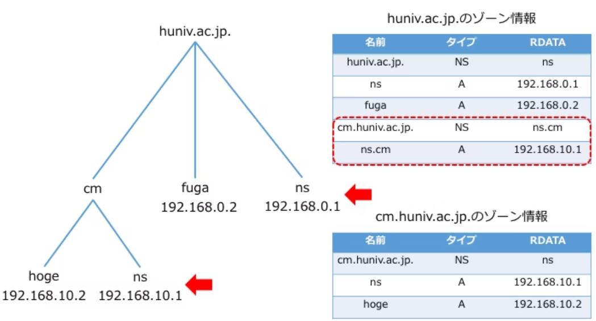

<h1>DNSをはじめよう</h1>

# chap1 ドメインと whois

ドメインを売るお店はレジストラとリセラの 2 種類


「リセラ(再販事業者)はレジストラ(登録事業者)からドメインを仕入れて、それを
再販している」という表現だと分かりやすいでしようか。つまりムームードメインは、お名前.com などのレジストラからドメインを仕人れてそれを再販している再販事業者なのです。

ドメインが生まれてから手元に届くまで

レジストラ?レジストリ?ごちやごちゃしてきたのでちょっと図で整理してみましょ う。ドメインは一番上のレジストリからレジストラに卸され、そこからさらにリセラに卸 されます。私たちはドメインが買いたかったら、前述のとおりレジストラから買うことも リセラから買うこともできます。(図 1.11)

レジストリとは登録管理組織のこと。icann の認定を受けなければならない。


1 つの TLD には 1 つのレジストリ

そもそもドメインは「example.co.jp や「yahoo.com のように.(ドット)で区切られ ています。このとき、いちばん右側の jp や com を TLD(トップレベルドメイン)と呼びます。そしてこの TLD は、1 つにつき必ず 1 つのレジストリ(登録管理組織)によって管理されている。

example.co.jp の TLD は jp ですが、この jp という会社日本レジストリサービス(通称 JPRS)がレジストリです。

yahoo.com などで使われている com という TLD のレジストリは「VeriSign GlobalRegistryServices」です。VeriSignGlobalRegistryServices は com だけでなく net や name など複数の TLD を保有している。

tokyo という TLD は GMO ドメインレジストリ株式会社がレジストリ。

ICANN がレジストリを決める

TLD が生まれてくる源泉となるレジストリは神のごとき存在で責任重大です。そんな重要なレジストリをどの会社に任せるのか、一体誰が決めるのでしよう?
「君が.jp のレジストリね!」と JPRS を選んだのは誰かというと、ICANN(アイキャン)という組織です。ICANN とはインターネットの IP アドレスやドメイン名などの資源を全世界的に調整・管理する非営利法人です。ここが全ドメインの本当の生産元と言ってもいいかもしれません。

Whois とは

ところで先ほどドメインを購人するとき「Whois 情報公開代行(新規登録と同時なら無料)」というチェックポックスにチェックを人れましたが、もしあそこでチェックを人れずに購入手続きを進めていくと「Whois 情報を登録してください」という住所や氏名を人力するページが出てきます。この Whois 情報というのは一体何なのでしよう?自宅の住所とか氏名とか、絶対登録が必要。

Whois とは、そのドメインを所有している組織や担当者の氏名、連絡先(住所・電話番号メールアドレス)、ドメインの有効期限などがインターネットで誰でも見られるサービスのことです。本当にインターネットで誰でも見られます。

Whois 検索はレジストリが提供しているサービスです。 レジストリがその TLD の、whois 情報を管理・公開しているのです。

ドメイン所有者を調べる

[JPRS WHOIS /JPRS](https://whois.jprs.jp/)


Whois を正確に登録しなければいけない理由

Whois とは、そのドメインを所有している組織や担当者の氏名、連絡先(住所・電話番号・メールアドレス)、ドメインの有効期限などがインターネットで誰でも見られるサービスのことでした。トラブルが発生したときにインターネットの利用者同士が連絡しあって、自律的にトラブルを解決できるようにするためです。トラブルというのは、たとえば「あなたが持っているドメインは我が社が商標登録しているブランドの名前です。30 日以内に譲渡しなければ不正競争防止法に基づいてドメイン名の使用停止を求める裁判を起こします」 というようなものです。

仕事の場合は前述のように Whois に正しい情報を登録すべきですが、個人でドメイン を買ったとき自宅の住所や名前を Whois に載せるのは抵抗があります。そこで「プライ パシーを守るため個人情報を Whois に載せたくない」という人のためにあるのが、先ほ ど出てきた「Whois 情報公開代行」というサービスです。 これは Whois 上で表示される組織名や連絡先を代理でお名前.com の情報にしてくれるサービスで、一般的にはプロキシサービスやプライバシーサービスと呼ばれています。 Whois 情報公開代行を使えば、Whois の所有者の欄には自分の名前の代わりに「Whois PrivacyProtectionServicebyonamae.com」と出るので個人情報を晒さなくて済みます。

finegiz の whois (verisign)

[Whois](https://webwhois.verisign.com/webwhois-ui/index.jsp?language=)


`aguse.jp`はドメインに関係なく whois で調べられる。取れる情報は少ない。

[aguse\.jp : 調査結果](https://aguse.jp/)


くトラブル>ドメイン情報認証メールを無視して全サイトが停止

各レジストラは Whois 情報をちゃんと登録してもらうために様々な取り組みを行って います。 たとえばお名前.com の場合、ドメインを新たに買ったり Whois 情報を変更したりした 場合、Whois に登録されたメールアドレスが正しいものか確認するため、登録したメー ルアドレス宛てに「ドメイン情報認証」という URL 付きメールが飛んできます。 そして 2 週間以内にメール本文中の認証 URL を踏まなかった場合、ドメインが利用停止になってしまいます。

この URL を踏まないまま 2 週間が経っとドメインは利用停止になります。しかも今回買った(あるいは Whois 情報を更新した)ドメインだけでなく、Whois に同じメールアドレスを登録している全てのドメインが同時に利用停止となりますので注意が必要です。お名前.com でドメインを買ったらこの 2 つを忘れずに行いましよう。

・Whois 情報をきちんと登録する  
・ドメイン情報認証のメールで URL を踏んで正確性確認を行う

※実際に、ドメイン情報認証のメールで URL を踏んでなかったので、ドメイン使用停止されてた。

お名前ドットコムでドメインを買ったら以下のサイトが見られることを確認する。
見れれば、ちゃんと購入できて、ちゃんと動作している。


# chap 2 dns の仕組み

DNS とは

DNS サーバの DNS は DomainNameSystem の略で、日本語に直訳すると「ドメイ
ン名の管理システム」といったところです。ーロに DNS サーバと言っても、その実態は 「ネームサーバ」と「フルリゾルバ」の 2 つに分かれています。異なる働きをする 2 つの サーバがどちらも「DNS サーバ」と呼ばれていることが、DNS を分かりにくくしている 一因だと筆者は思います。DNS の仕組みの解説に人る前にきちんとこの 2 つを整理して おきましよう。

ネームサーバ  
ネームサーバは「電話帳」のような役割を果たします。 電話帳には名前とそれに紐づく電話番号が書いてありますが、ネームサーバにはドメイ ンとそれに紐づく IP アドレスが登録されています。 ネームサーバは「DNS コンテンツサーバ」「権威 DNS サーバ」と呼ばれることもあり ますが、本著では統一してネームサーバと呼びます。

フルリゾルバ  
フルリゾルバは「秘書」のような役割を果たします。フルリゾルバに「このドメインに紐づく IP アドレスが知りたいの」と言うと、あちこちのネームサーバに聞きまわって IP アドレスを調べてきて教えてくれます。しかも一度 調べると一定期間はそのドメインと IP アドレスの紐づけを記憶(キャッシュ)するため、 もう 1 回同じことを聞くと今度はすぐに教えてくれます。 あなたがブラウザでウェブサイトを見るときは必ずこのフルリゾルバにドメインの名前解決を頼んでいます。「でもそんなもの使う設定をした記憶ないけどと思われる かも知れませんが、会社のオフィスなら情シスが、家庭なら契約している ISP がフルリゾルバを用意していて、自動で「このフルリゾルバを使ってね」と割り当てられているので意識していないだけです。 情シスや ISP がそれぞれのネットワーク内で提供しているフルリゾルバの他に、Google public DNS や Cloudflare のようにだれでも無料で使えるオープンリゾルバというものがあります。

お名前.com のページが表示されるまで


1. ブラウザは、フルリソルバに startdns.fun に紐づく ip アドレスを聞きに行く
2. フルリソルバは自分の中に startdns.fun に紐づくアドレスのキャッシュがないことを確認
3. フルリソルバはルートネームサーバに startdns.fun に紐づくアドレスを聞きに行く
4. ルートネームサーバは.fun のネームサーバは a.nic.fun だよ」と教えてくれる
5. フルリソルバは a.nic.fun に startdns.fun に紐づく ip アドレスを聞きに行く
6. a.nic.fun は「startds.fun のネームサーバは 「dns1.onamae.com だよ」と教えてくれる
7. フルリソルバは dns1.onamane.com に starddns.fun に紐づくアドレスを聞きに行く
8. dns1.onamae.com は「startdns.fun に紐づく ip アドレスは「150.95.255.38」だよ」と教えてくれる
9. フルリゾルバが「startdns.fun」に紐づくアドレスは「150.05.255.38」と教えてくれる
10. 150.95.255.38(ウェブサーバ)に、startdns.fun のページをリクエスト
11. 150.95.255.38(ウェブサーバ)がページを返してくれる

ゾーンと委任

このように DNS は「1 つのネームサーバが何もかも知っている」という集中管理ではなく、「いくつかのネームサーバに聞けは答えにたどり着く」という管理権限の分散された仕組みになっています。

ルートネームサーバは.fun のことはネームサーバ a.nic.fun に任せていました。このとき「.fun」、や「startdns.fun」 のような範囲をゾーンと呼びます。

a.nic.fun というネームサーバは、自分が任されている.fun というゾーンの中で、.fun のサブドメインにあたる startdns.fun というゾーンについては dnsl.onamae.com に任せていました。

このように自身が任されているゾーンを分割して、その一部のゾーンを他のネームサーバに任せることを委任と呼びます。

リソースレコード

ネームサーバの中にある電話帳は管理しやすいように「startdns.fun の電話帳」 「example.corn の電話帳」のようにドメインごとに分かれています。この一冊一冊の電話 帳が管理している範囲を前述のとおりゾーンと呼びます。 そしてこのゾーンの中にある「ドメインと IP アドレスの紐づけ」ひとつひとつのことをリソースレコードと呼びます。たとえば startdns.fun のゾーンの中には「startdns.fun とそれに紐づく IP アドレス」や「www.startdns.funとそれに紐づくIPアドレス」のようにたくさんのリソースレコードを書くことができます。 リソースレコードには次(表 2.1)のように A レコードや MX レコードといった種類
があり、それぞれ書き方も決められています。


# chap 3 aws のネームサーバ(route53)を使ってみよう

ドメインのネームサーバを Route53 に変更

1. お名前.com で買ったドメインのネームサーバを Route53 に変更
   先ずは Route53 で自分のドメインのゾーンを作成します。

route53 でホストゾーンを作成


ホストゾーンの作成


Type はパブリックホストゾーンを選択します。パブリックホストゾーンにしておけば外から「このドメインに紐づいてる IP はなに?」と聞かれたときに Route53 のネームサーバが「IP は〇〇だよ」と返事をします。ここをプライベートホストゾーンにすると、aws 内での名前解決しかできなくなる。

これで Route53 というネームサーバの中に自分のドメインのゾーンが出来て、ゾーン の中にドメインのネームサーバを示す NS レコードと管理情報を示す SOA レコードとい うリソースレコードも出来ました。(図 3.22)


SOA レコード


自分のドメインのネームサーバが何か確認

```
book-dsn-hahimeyo $ nslookup  -type=ns finegiz.com
Server:         10.255.255.254
Address:        10.255.255.254#53

Non-authoritative answer:
finegiz.com     nameserver = dns2.onamae.com.
finegiz.com     nameserver = dns1.onamae.com.

Authoritative answers can be found from:
```

finegiz.com というゾーンがお名前ドットコムのネームサーバに委任されている


このようにお名前.com のネームサーバと Route53 のネームサーバ、どちらにも finegiz.com のゾーンがあるのですが、上位ネームサーバが「finegiz.com については dnsl.onamae.com に委任する」という設定なので、お名前.com のネームサーバが finegize.com の権威を持った状態になっています。そのため finegiz.com の NS レコードを問い合わせたときに誰も Route53 のネームサーバには聞きに来ないのです。 そもそもお名前.com でドメインを買うと、デフォルトの設定でネームサーバには次の 2 つが設定されています。

```
nameserver = dns2.onamae.com.
nameserver = dns1.onamae.com.
```

そのためネームサーバを Route53 に変更したければ、Route53 で自分のドメインの ゾーンを用意するだけでなく、さらにお名前.com の管理画面で「ゾーンはお名前.com にある」という設定を「ゾーンは Route53 にある」という設定に書き換えなければいけなかったのです。

ネームサーバをお名前.com から Route53 に変更

aws コンソール レコードタイプ ns 値を記録


お名前ドットコム

ネームサーバ設定


その他のネームサーバを使う


ok


書き換わっていることを確認


ネームサーバをお名前.com から Route53 に変更しましたが、古い設定の TTL が過ぎるまでフルリゾルバにはキャッシュが残っています。 TTL とは TimeToLive の略でキャッシュ保持時間のことです。

※ネットの状況によっては反映されるまで 72 時間かかると注意ができるが、基本 TTL が過ぎたらネームサーバが切り替わる

```
book-aws-lambda-jissen-guide2 $ nslookup -debug  -q=mx finegiz.com
Server:         10.255.255.254
Address:        10.255.255.254#53

------------
    QUESTIONS:
        finegiz.com, type = MX, class = IN
    ANSWERS:
    AUTHORITY RECORDS:
    ->  finegiz.com
        origin = ns-295.awsdns-36.com
        mail addr = awsdns-hostmaster.amazon.com
        serial = 1
        refresh = 7200
        retry = 900
        expire = 1209600
        minimum = 86400
        ttl = 861 <<<
    ADDITIONAL RECORDS:
```

server 10.255.255.254 は以下のファイルで設定されている

```
book-dsn-hahimeyo $ cat /etc/resolv.conf
# This file was automatically generated by WSL. To stop automatic generation of this file, add the following entry to /etc/wsl.conf:
# [network]
# generateResolvConf = false
nameserver 10.255.255.254
book-dsn-hahimeyo $ kk
```

#chap 4 dig と whois を叩いて学ぶ DNS

utuntu にデフォルトでは入っていなので、whois インストール

```
book-aws-lambda-jissen-guide2 $ sudo apt install whois
```

ドメインに紐づく IP アドレスを調べたいとき、あるいは IP アドレスに紐づくドメイ
ンを調べたいときは dig コマントを使用します。

```
book-aws-lambda-jissen-guide2 $ dig techbookfest.org

; <<>> DiG 9.18.30-0ubuntu0.20.04.2-Ubuntu <<>> techbookfest.org
;; global options: +cmd
;; Got answer:
;; ->>HEADER<<- opcode: QUERY, status: NOERROR, id: 15788
;; flags: qr rd ra; QUERY: 1, ANSWER: 4, AUTHORITY: 0, ADDITIONAL: 1

;; OPT PSEUDOSECTION:
; EDNS: version: 0, flags:; udp: 1280
;; QUESTION SECTION:
;techbookfest.org.              IN      A

;; ANSWER SECTION:
techbookfest.org.       300     IN      A       151.101.66.133
techbookfest.org.       300     IN      A       151.101.130.133
techbookfest.org.       300     IN      A       151.101.194.133
techbookfest.org.       300     IN      A       151.101.2.133

;; Query time: 179 msec
;; SERVER: 10.255.255.254#53(10.255.255.254) (UDP)
;; WHEN: Fri Feb 14 16:26:28 JST 2025
;; MSG SIZE  rcvd: 109
```

ip アドレスだけ知りたいとき

```
book-aws-lambda-jissen-guide2 $ dig techbookfest.org +short
151.101.2.133
151.101.194.133
151.101.130.133
151.101.66.133
```

Whois を叩いてドメインや IP の持ち主を調べよう

```
book-aws-lambda-jissen-guide2 $ whois tic-keisokuki.co.jp
[ JPRS database provides information on network administration. Its use is    ]
[ restricted to network administration purposes. For further information,     ]
[ use 'whois -h whois.jprs.jp help'. To suppress Japanese output, add'/e'     ]
[ at the end of command, e.g. 'whois -h whois.jprs.jp xxx/e'.                 ]
Domain Information: [ドメイン情報]
a. [ドメイン名]                 TIC-KEISOKUKI.CO.JP
e. [そしきめい]                 てぃ・あい・しぃけいそくきこうぎょう
                                かぶしきがいしゃ
f. [組織名]                     ティ・アイ・シィ計測器工業株式会社
g. [Organization]               TIC Co.Ltd
k. [組織種別]                   株式会社
l. [Organization Type]          Company
m. [登録担当者]                 TK11249JP
n. [技術連絡担当者]             TA4682JP
p. [ネームサーバ]               ns1.dns.ne.jp
p. [ネームサーバ]               ns2.dns.ne.jp
s. [署名鍵]
[状態]                          Connected (2025/12/31)
[登録年月日]                    2001/12/05
[接続年月日]                    2001/12/06
[最終更新]                      2025/01/01 01:01:52 (JST)
```

dig を叩いてリソースレコードを確認してみよう

```shell
book-dsn-hahimeyo $  dig tic-keisokuki.co.jp a +short
153.120.128.241
```

MX レコード

「〇〇@example.co.jp」というメールアドレス宛てにメールを送ったらこのメールサーバで受信します、という設定をしているのが MX レコードです。「このメールアドレスってメールはどこで受信してるんだっけ?」と思ったら、dig コマンドを叩いてみましよう。

```
book-dsn-hahimeyo $ dig tic-keisokuki.co.jp mx +short
10 mail.tic-keisokuki.co.jp.
```

mail.tic-keisokuki.co.jp というのがメール受信サーバであることが分かりました。先頭の 10 はプリファレンス値といって「メールサーバが複数台ある場合の優先度」を表しています。MX レコードは複数設定できるため、プリファレンス値が 10 のメールサーバを複数台用意して負荷を分散したり、プリファレンス値が 10 のメールサーバが落ちていたら代わりにプリファレンス値が 20 のメールサーバで受信するというように冗長性を高めたりできます。 dig で A レコードを引くと、最終的にはメール受信サーバの IP アドレスまでたどり着くことができます。

```
book-dsn-hahimeyo $ dig mail.tic-keisokuki.co.jp a +short
182.48.49.56
```

MX レコードがなければ代わりにウェブサーバ宛てにメールが届く  
もし MX レコードが存在しなかったら、メールを送ろうとしたとき、そのドメインの MX レコードが存在しなかったらメールを送信できないのではなく、代わりに A レコードで紐づけられている IP アドレスに対してメールを送ろうとします。

そのドメインでメールを受信する予定がないのであれば、次のようにプリファレンス 値を「0(ゼロ)」、メールサーバ名を「.(ドット)」にした Null MX を設定することで「メールを受信しません」という意図を明示しておく方が、メールを送る側も受信する側にも余計な負担がなくなってよい。

NS レコード  
ドメインのネームサーバを示すリソースレコード。
ドメイン自身、及びサブドメインのネームサーバを記述する。

サブドメインの管理は、サブドメインに権限移譲することができる。



「ドメイン名前空間に huniv.ac.jp.を登録する」ということは、「JPRS が管理する ac.jp.のネームサーバに CNAME レコードと A レコードを登録してもらう」ということ。


```
book-dsn-hahimeyo $ dig tic-keisokuki.co.jp ns +short
ns1.dns.ne.jp.
ns2.dns.ne.jp.
book-dsn-hahimeyo $
```

SPF レコード(TXT レコード)  
メールもそれと同じで、送信元のメールアドレスを詐称して送信することは容易です。迷惑メールの多くはこのように送信元を詐称しているなりす ましメールです。このとき送り主が本物なのか、あるいは自分の持ち物でないドメインで送信元を詐称して勝手にメールを送っている「なりすましメール」なのかを確認する手段として、SPF レコードというものがあります。SPF レコードは次の dig コマンドで確認でき ます。

SPF レコードなのに txt なの?と疑問に思われるかも知れません。昔は SPF を設定する方法として SPF レコードと TXT レコードという 2 種類のリソースレコードに書くことが推奨されていたのですが、SPF レコードに書く方法は普及せず、最終的に「SPF は TXT レコードで設定すること」となりました。

たとえばポケモンだいすきクラブから届く「ポケモンだいすき!通信」というメールは、送信元のメールアドレスがnoreply@pdc.pokemon.jpです。pdc.pokemon.jp の SPF レコードを確認してみましよう。o

```
book-dsn-hahimeyo $ dig pdc.pokemon.jp txt +short
"v=spf1 include:spf.pdc.pokemon.jp include:spf.pokemon.mailds.jp ~all"
"google-site-verification=Vg3Ar1_hRlrET3eyTiQS8ONtb_ijVAZh1ME3FaWX-Mw"
```

include は引数で渡しているドメインの SPF レコードを含むという意味ですので、さらに spf.pdc.pokemon・jp と spf.pokernon.mailds.jp の SPF レコードを引いてみましよう。

```
book-dsn-hahimeyo $ dig spf.pdc.pokemon.jp txt +short
"v=spf1 +ip4:203.216.217.0/24 +ip4:122.212.36.0/24 +ip4:202.8.80.0/23 +ip4:202.74.4.160/27 +ip4:59.159.71.0/24 +ip4:220.110.139.188/32 +ip4:211.120.127.41/32 +ip4:125.29.35.0/26 +ip4:124.211.29.64/26 +ip4:122.215.202.64/26 +ip4:203.138.159.219 ~all"
```

`+ip4:203.216.217.0/24`は`4:203.216.217.0～4:203.216.217.255`の IP アドレスをメールの送信元サーバーとして認めるという意味。

SPF レコード解説

なぜ必要か  
メール送信のプロトコル、SMTP のセキュリティ上の弱点として、誰でも任意のドメインの差出人になりすますことができる、というものがある。
SPF レコードを設定することによって、自分が所有しているドメインを使ったメールアドレスから、第三者が自由にメールを送信することを防ぐことができる。

設定方法
所有するドメインの TXT レコード(自由にコメントをかけるレコード)に v=spf で始まる以下のような形式で記述することにより、SPF レコードとして認識されるようになる。

```
example.jp. IN TXT "v=spf1 +ip4:192.168.100.0/24 ~all"
example.jp. IN TXT "v=spf1 include:kagoya.net ~all"
```

SPF レコードが使われるタイミング

メール受信サーバーが、メール受信の直前に、DNS サーバーに SPF レコードがあるかどうか確認する
↓  
・レコードがなければ普通に受信  
・レコードがあれば、送信元の IP アドレスと SPF レコードに書かれている IP アドレスが一致しているか確認し、一致しなければ受信を拒否する


PTR レコード  
A レコードは前述のとおりドメインから IP アドレスを正引きできるレコードです。対して IP アドレスからドメインを逆引きできるレコードのことを PTR レコートと呼びます。PTR レコードは次の dig コマンドで確認できます。 メールを受信するメールサーバによっては「メール送信元の IP アドレスが SPF レコードに登録されていること」たけでなく「メール送信元の IP アドレスからドメインの逆引きができること」という条件も満たさないと迷惑メールと判断することがあります。

```
book-dsn-hahimeyo $ dig -x 216.58.197.14 +short
kix06s02-in-f14.1e100.net.
kix06s02-in-f14.1e100.net.
```

```
book-dsn-hahimeyo $ dig aibo.sony.jp a +short
aibo.sony.jp.edgekey.net.
e187322.a.akamaiedge.net.
23.55.129.33
23.55.129.32
book-dsn-hahimeyo $
```

CNAME レコード  
ときどきドメインから IP アドレスを引こうとして dig で A レコードを調べたのにこんな風にドメインと IP アドレスが返ってくることがあります。

```
book-dsn-hahimeyo $ dig aibo.sony.jp a +short
aibo.sony.jp.edgekey.net.
e187322.a.akamaiedge.net.
23.55.129.33
23.55.129.32
```

詳細に見る

```
book-dsn-hahimeyo $ dig aibo.sony.jp a
:::::::::
;; ANSWER SECTION:
aibo.sony.jp.           226     IN      CNAME   aibo.sony.jp.edgekey.net.
aibo.sony.jp.edgekey.net. 5523  IN      CNAME   e187322.a.akamaiedge.net.
e187322.a.akamaiedge.net. 20    IN      A       23.46.229.51
e187322.a.akamaiedge.net. 20    IN      A       23.46.229.98
:::::
```

aibo.sony.jp の cname レコードに aibo.sony.jp.edgekey.net が設定されている。
`aibo.sony.jp`をエイリアス。aibo.sony.jp.edgekey.net を canonical name(正式名)と呼ぶ。

さらに、aibo.sony.jp.edgekey.net がエイリアス、e187322.a.akamaiedge.net が正式名となっている。
e187322.a.akamaiedge.net の A レコードに IP が設定されている。

cname を使うメリット  
たとえば、www.example.comをexample.comにCNAMEで紐づけることで、example.comのAレコード変更だけでwww.example.comも追随させることができます。
A レコード変更だけでwww.example.comも追随させることができます。

e187322.a.akamaiedge.net に 2 つの IP アドレスがある理由は、冗長性と負荷分散のためです。

冗長性: 複数の IP アドレスを持つことで、1 つのサーバーがダウンしたり到達できなくなった場合でも、他のサーバーがリクエストを処理することができます。これにより、ウェブサイトの信頼性と可用性が向上します。

負荷分散: 複数の IP アドレスを使用することで、トラフィックを異なるサーバー間で分散させることができます。これにより、どのサーバーも過負荷にならず、ユーザーにとってスムーズで迅速なアクセスが確保されます。

このケースでは、23.46.229.51 と 23.46.229.98 の 2 つの IP アドレスが e187322.a.akamaiedge.net に割り当てられており、どちらのサーバーもリクエストを処理することができます。この設定により、サービスのパフォーマンスと信頼性が向上します。

このような階層的な CNAME（Canonical Name）レコードの設定にはいくつかの理由があります。  
管理の柔軟性: aibo.sony.jp.edgekey.net と e187322.a.akamaiedge.net の両方を使用することで、各 CNAME の一部を独立して管理できます。例えば、edgekey.net の部分を管理する際には、他の部分（e187322.a.akamaiedge.net）を変更する必要がありません。
負荷分散とコンテンツ配信ネットワーク（CDN）: aibo.sony.jp.edgekey.net は、Akamaiedge のような CDN プロバイダに関連付けられていることが多いです。この設定により、トラフィックを効率的に最寄りの CDN エッジサーバーに分散させることができます。これにより、ユーザーのアクセス速度が向上します。  
セキュリティ: 階層的な設定を行うことで、より細かくアクセス制御やセキュリティ設定を行うことが可能になります。各レイヤーで異なるセキュリティポリシーを適用できます。  
運用上の便利さ: もしも e187322.a.akamaiedge.net が変更される場合、CNAME レコードを更新するだけで済むため、システム全体を調整する手間が省けます。  
これらの理由により、複数の CNAME レコードを使用することで、より柔軟かつ効率的な運用が可能になります。

e187322.a.akamaiedge.net が変更される場合は、いくつかの状況が考えられます。例えば：  
サーバーの移行: サーバーのハードウェアやインフラの更新が必要になった場合、新しい IP アドレスに変更することがあります。  
負荷分散の最適化: トラフィックの増加やパフォーマンスの向上を目的として、より効率的なサーバーに移行する場合があります。  
セキュリティの理由: セキュリティ上の理由から IP アドレスを変更することがあります。例えば、DDoS 攻撃からの防御や、脆弱性の対策として変更する場合があります。  
ネットワークの再構成: ネットワークの再構成や IP アドレスの割り当ての変更に伴い、新しい IP アドレスを使用することがあります。  
契約の変更: CDN プロバイダとの契約内容が変更された場合、IP アドレスも変更されることがあります。  
これらの理由により、e187322.a.akamaiedge.net の IP アドレスが変更されることがあります。変更があった場合、DNS 設定を更新することで新しい IP アドレスに対応します

フルリゾルバは aibo.sony.jp の A レコードを調べに行って、A レコードの代わりに CNAME レコードが見つかった場合、名前解決の対象を正式名に置き換えて引き続き A レコードを調べ、最終的に正式名の A レコーードに紐づく IP アドレスを返してきます。 このように CNAME レコードが設定されているときは、A レコードを問い合わせて も結果として CNAME レコードと、その正式名の A レコードの両方が返ってきます。
